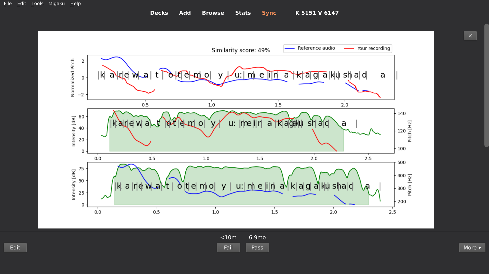

[](https://gitter.im/itsupera-onsei/community?utm_source=badge&utm_medium=badge&utm_campaign=pr-badge)
<span class="badge-buymeacoffee">
<a href="https://www.buymeacoffee.com/itsupera" title="Donate to this project using Buy Me A Coffee"></a>
</span>

Onsei Anki: Anki plugin for pitch accent practice
==================================================

This addon helps you practice your [Japanese pitch accent](https://www.kanshudo.com/howto/pitch)
while you do your Anki reps on [audio sentence cards](https://www.youtube.com/watch?v=zMBXwo9SJbQ) !

It will compare your own recording with the card's sentence audio and show you where your intonation differed from it.



Under the hood, it is using my [Onsei](https://github.com/itsupera/onsei) project.
Check it out for the technical details.

**IMPORTANT NOTE: THIS IS STILL A WORK IN PROGRESS, PLEASE REPORT ANY ISSUE AND SHARE IMPROVEMENT IDEAS !**

Setup
------

For now, the following instructions have only been tested on Ubuntu Linux and with Anki 2.1.35.

1) Copy the `onsei_anki` folder into the Anki addons folder.

- On Windows: `C:\Users\<YOUR_USER_NAME>\AppData\Roaming\Anki2\addons21`
- On Linux: `~/.local/share/Anki2/addons21`
- On MacOS: `~/Library/Application Support/Anki2/addons21`

2) Run (or restart) Anki

3) Configure the addon: go to the `Addons` menu (Ctrl+Shift+A), select `Onsei` and click on `Config`

- Add to `sentence_audio_fields` the name of the fields where you put your sentence audio.
- Add to `sentence_transcript_fields` the name of the fields where you put your sentence transcription.

Usage
------

- When reviewing a card, press `Ctrl+v` to record yourself, then press `Enter` to validate (or `Esc` to cancel).
- The addon will automatically reveal the answer and display a graph comparing your intonation to the sentence audio.
- You can press `r` to re-listen to the sentence audio, or `v` to re-listen to your audio

Here are two ways you can use it:

- Repeating or shadowing exercice on Audio sentence cards (audio on front, text on back)
- Reading exercice on Text Sentence cards (text on front, audio on back)

Running the API locally
------------------------

By default, the addon will connect to an instance of Onsei API running on a distant server.

If you want to run it locally, use the following command (on Linux):

```bash
docker run --network=host itsupera/onsei-api
```

and change `api_url` to `http://127.0.0.1:8000` in the addon's configuration.

Refer to the [Onsei](https://github.com/itsupera/onsei) project for more details about the API.

Troubleshooting
----------------

If your problem is not described below,
please report it in the
[Onsei community chat](https://gitter.im/itsupera-onsei/community?utm_source=badge&utm_medium=badge&utm_campaign=pr-badge)

---
Q: Graphs keep showing up even after I clicked the close button !

A: If you don't want to see the graphs anymore,
disable the addon (Open `Addons` menu with Ctrl+Shift+A, select "Onsei"
and click `Disable`) then restart Anki.

---

Q: I always get an "Error" when I record myself

A: Try to speak closer to your microphone, eliminate background noises and
make a short pause before and after you speak. I might also be because
the sentence audio has some background noise itself, such as a BGM.

---

Q: Those graphs are too big !

A: You can configure the size by changing the `graph_height_in_pixels` value
in the addon configuration screen (Open `Addons` menu with Ctrl+Shift+A,
select "Onsei" and click `Config`)
